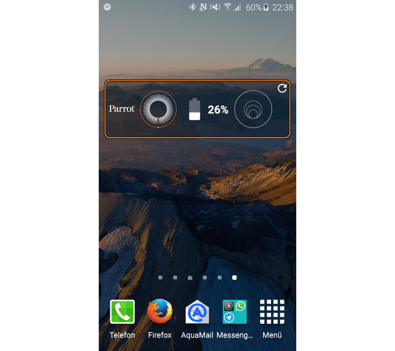
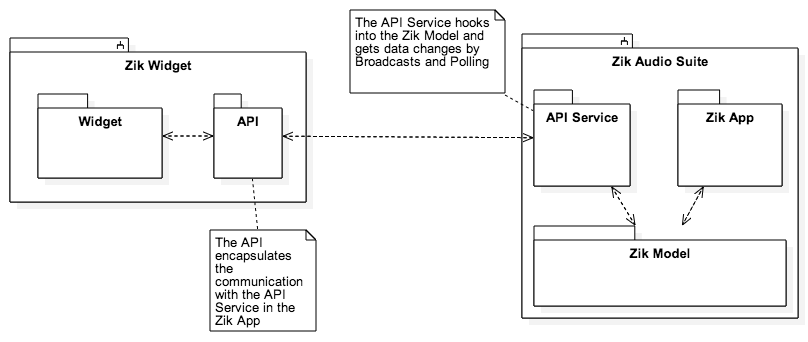

# parrot-zik-2-supercharge
Utilities and framework to enhance the original Parrot Zik 2 app by adding an Android API to it.
The scripts are currently tested on Mac, Ubuntu and Windows.

This project is for every Parrot Zik 2 owner that wants to get an extra bit out of their headphones.

##How it looks

##How it works

It consists of
### Parrot Zik 2 app patch
A patch that extends the original Parrot Zik 2 app and adds an API Service to it
### API library
A library for communication with the patched Parrot Zik 2 app.
### Widget app
App that contains a widget that uses the API to get the battery level and to toggle the noise cancellation mode

The whole thing is more a proof of concept than a real app. Currently the API contains only the methods to access the data currently needed by the widget.
A first goal is to extend the API to support all possible Parrot Zik 2 parameters.

## Usage
The structure of this project replicates the steps neccessary to create your own patched Parrot Zik 2 app.
When a Script is referred then just take the correct version for your OS (sh, cmd)

### 00_source
Copy the original Parrot Zik 2 apk (base.apk) into this directory.
Because of potential legal issues the Parrot Zik 2 apk can't be provided here.
Instead you can install it directly from Google Play (https://play.google.com/store/apps/details?id=com.parrot.zik2) and use other methods to get the apk from your phone.

### 01_key
In order to create a patched Parrot Zik 2 apk you need to provide a keystore so that the apk can be signed.
If you don't want to change the "05_compile" script you have to name the keystore "de.devmil.parrotzik2supercharge.keystore" and name the alias "market".
You can choose whatever filename and alias you like but you then have to adapt the "05_compile" script accordingly.

### 02_decompile
This script decompiles the "base.apk" from the "00_source" directory and places the decompiled bits into the "00_source" directory.
It also patches the AndroidManifest.xml to contain the API Service.

### 03_project
This folder contains the Android Studio project that contains the api, the widget and the files to patch into the Parrot Zik 2 app.
In order to go on (and every time you made any changes in the "dummy_app" that contains the patches) you have to build the "dummy_app" so that the Android build process creates the neccessary intermediate files.

### 04_patch
This script prepares all the patch intermediate files and copies them into the 00_source folder. 

### 05_compile
This script compiles and signs the apk that now contains the patch. You will be prompted to enter your keystore password.

### 06_result
This folder will contain the signed and patched Parrot Zik 2 apk. You can install this apk onto your device.

## Multiple steps at once
There are two scripts that combine the steps needed to prepare and to recompile the package.

### 10_prepare_original_apk
This script checks all input files and prepares the package for patching. This step has only to be done once (as long as the source package doesn't change)

### 11_patch_and_copy
This script copies all the intermediate files from 03_project and patches the Parrot Zik 2 apk. It packages it, signs it and copies it to the 06_result folder.

## Prerequisites
In order for the scripts to work you will have to prepare your machine.
You need an Java JRE so that the utilities bundled with this project can be executed. You have to make sure that your path points to the bin directory (where the jarsigner tool resides)
You need an Android sdk and one of the build-tools subdirectories (the version numbers) have to be in your path so that the dx command will work.